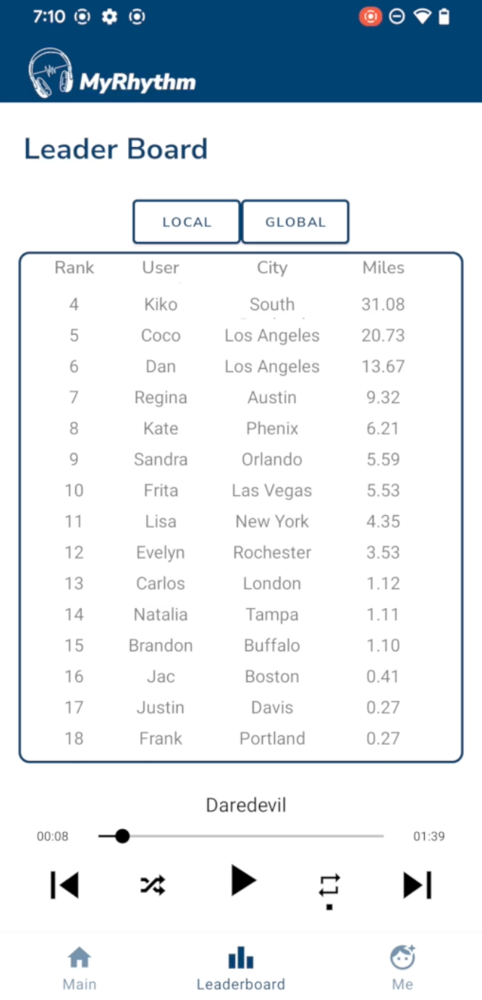

# MyRhythm - A Running App for Music Lovers

 
## Introduction
MyRhythm is the ultimate running companion app. It syncs your running tempo with music of matching BPM, using mobile sensors to track your pace. The app also includes a global leaderboard, badge rewards, and local weather display.

 

By Jacquelyn (Junting) Xiong
Aug 15, 2022

 
## Features

#### 1. Running Tempo Tracker
Uses mobile sensors to track your running tempo and play music that matches your pace.

#### 2. Music Playlist
Features a vast selection of songs that are sorted based on BPM to match your running tempo.

#### 3. Leaderboard
Features a local and global leaderboard where you can compete with other runners in your area or around the world.

#### 4. Google Maps Integration
Integrates Google Maps APIs to display your geographical information and to enable the leaderboard feature.

#### 5. Local Weather Display
Displays the local weather information to help you plan your runs better.

#### 6. Real-time Display
Real-time display of your running stats.

## Technologies

#### Android Studio
MyRhythm uses Android Studio for the user interface (UI) and to implement Navigation bar, Activities, Fragments, RecyclerView, ListViews, etc.

#### Firebase Realtime Database
The app uses Firebase for database and authentication, which enables real-time display of users' data.

 

## Screenshots

#### 1. Home page

#### 2. Leaderboard

#### 3. Register & Login
 

#### 4. Liked Songs

#### 5. Settings
 
