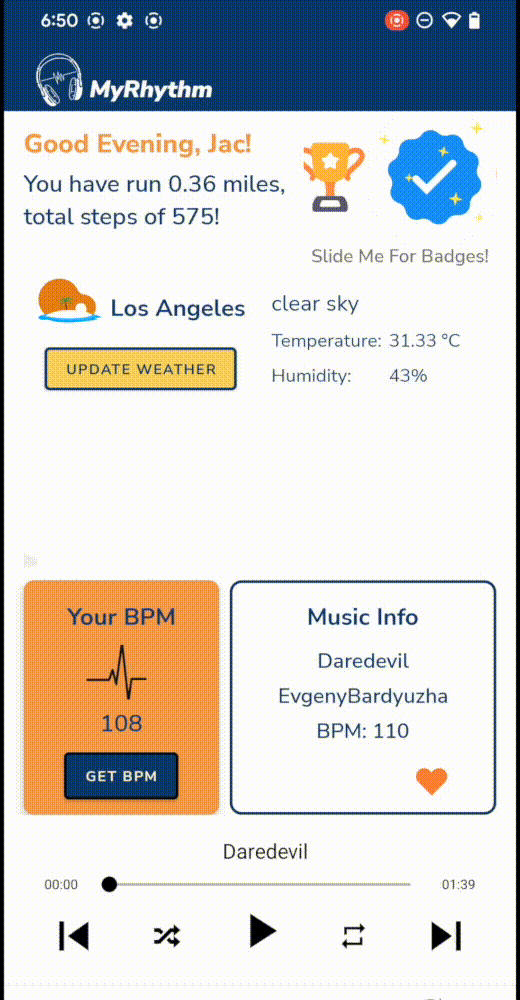
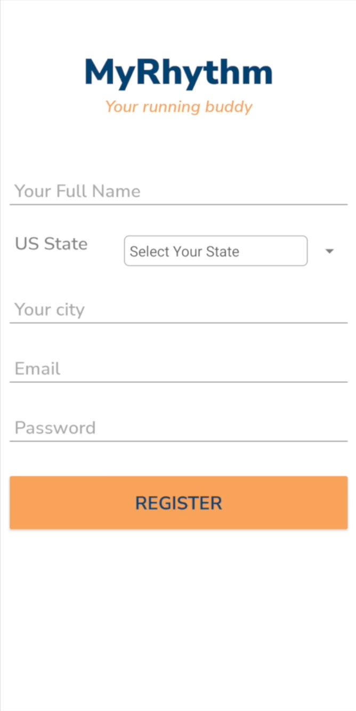
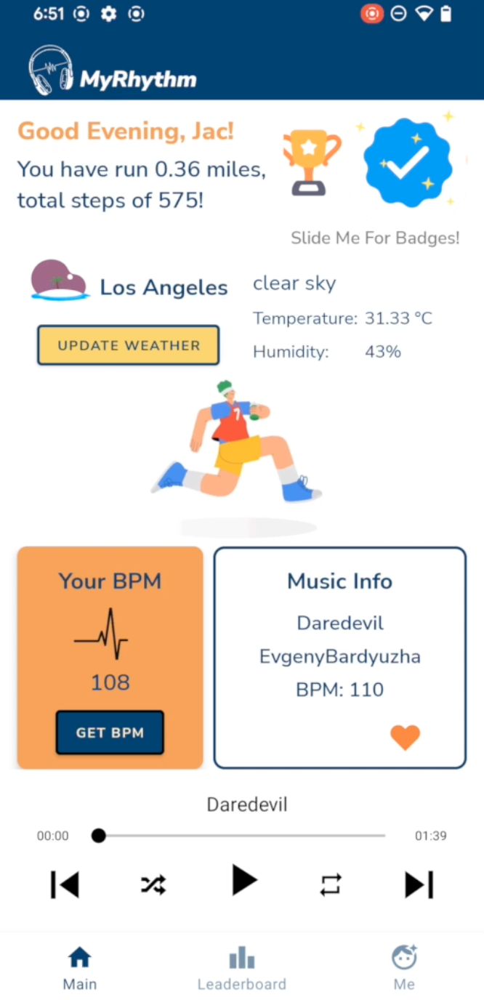
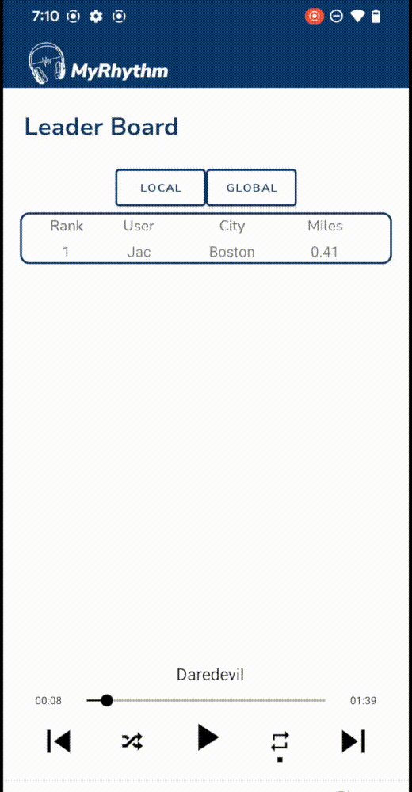
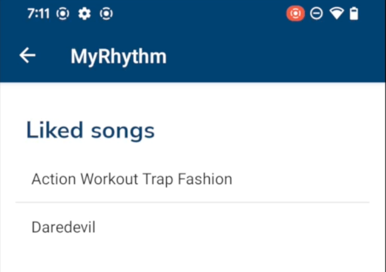
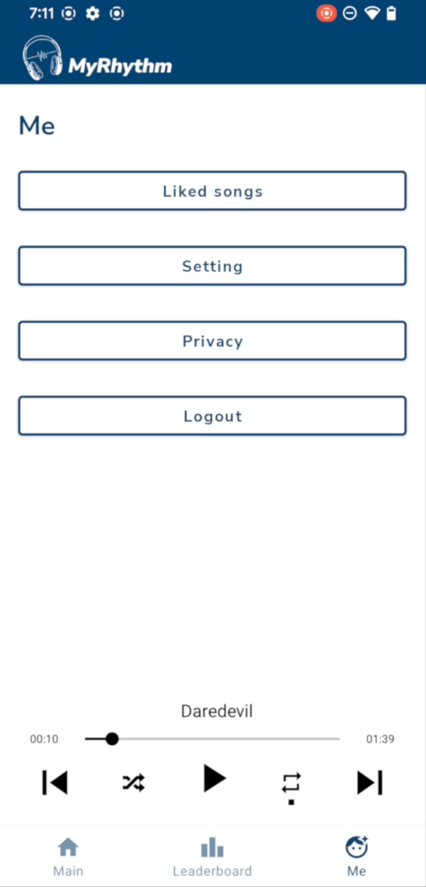
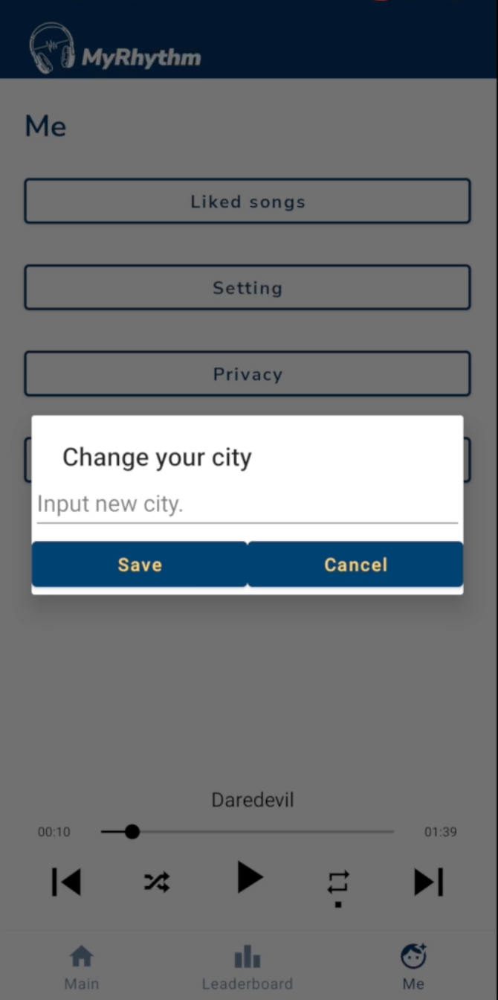

# MyRhythm - A Running App for Music Lovers

# CS5520 FinalProject

 
## Introduction
MyRhythm is a mobile application designed to enhance your running experience by syncing your running tempo with music of matching BPM. The app uses mobile sensors to track your running tempo and play music that matches your pace. MyRhythm also features a local and global leaderboard, special badge rewards system, integrated Google Maps APIs for geographical information, and a local weather display.

By Jacquelyn (Junting) Xiong
Aug 15 2022

 
## Features

#### Running Tempo Tracker
MyRhythm uses mobile sensors to track your running tempo and play music that matches your pace.

#### Music Playlist
The app features a vast selection of songs that are sorted based on BPM to match your running tempo.

#### Leaderboard
MyRhythm features a local and global leaderboard where you can compete with other runners in your area or around the world.

#### Google Maps Integration
The app uses Google Maps APIs to display your geographical information and to enable the leaderboard feature.

#### Local Weather Display
MyRhythm displays the local weather information to help you plan your runs better.

#### Real-time Display
The app features real-time display of your running stats, including distance, time, and pace.

## Technologies

#### Android Studio
MyRhythm uses Android Studio for the user interface (UI) and to implement Navigation bar, Activities, Fragments, RecyclerView, ListViews, etc.

#### Firebase Realtime Database
The app uses Firebase for database and authentication, which enables real-time display of users' data.

 

## Screenshots

#### 1. Register

#### 2. Login

#### 3. Home page

#### 4. Leaderboard

#### 5. Liked Songs

#### 6. Settings

#### 7. Edit Settings
